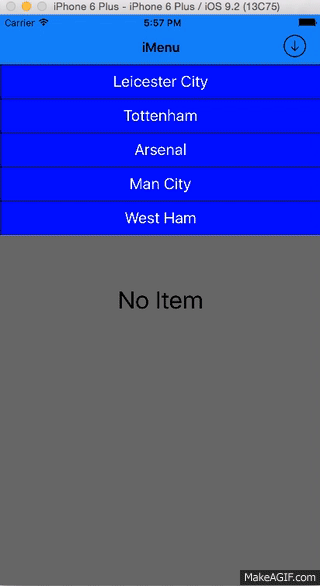

# iMDropdownMenu

#Language

##Tools
Swift 2.2, Xcode 7.3, Cocoa Touch, Git 

##How to use
	
	  let	menu = iMenu(frame: CGRectMake(0, 64, CGRectGetWidth(self.view.frame), 200)) // create new instance with frame
		menu.addItems(["Create Item","Create Discount"]) // set the menu list item
		menu.delegate = self // assign the delegate
		menu.addToView(self.view) // add the dopdown menu to the view controller content view
		//Now implement the delegate method within your viewcontroller

## Contributing
Forks, patches and other feedback are welcome.

## Creator
[Muzahidul Islam](http://mmsaddam.github.io/) 
[Blog](http://mmsaddam.github.io/)

## License
iMDropdownMenu is available under the MIT license. See the LICENSE file for more info.
